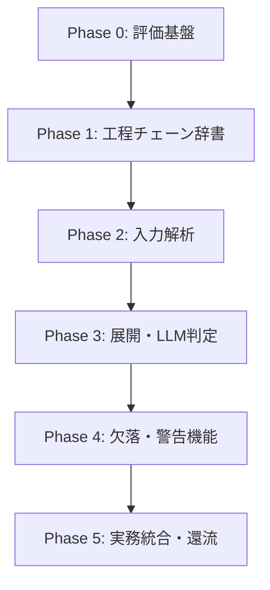

# roadmap.md

建築見積「項目出し」高精度化（construct_quotation）プロジェクトのロードマップ。

---

## ロードマップ概要

本プロジェクトは、評価基盤の構築から始まり、辞書の構築、入力解析、LLMによるフィルタリングと欠落チェック、そして実務フィードバックのサイクルへと段階的に進めます。

---

## 各フェーズの詳細

### Phase 0 — 評価基盤（評価スクリプトと正解セット）
- **目標**: 評価データ（完全分解チェーン）を整備し、ツールのRecall（再現率）を客観測定できるようにする。
- **タスク**:
  - オンライン標準仕様を元にした「正解データ（Ground Truth）」の作成方法のルール化。
  - Recall / Precision 計算用の自動評価スクリプトの整備。
  - 過去見積からの「漏れ実例集」の収集（検証用）。

### Phase 1 — 背骨：工程チェーン辞書の構築
- **目標**: 仕上げ項目から前工程を標準展開するための「辞書（マスター）」を構築。
- **タスク**:
  - `spec.md` に基づくJSONスキーマの定義。
  - 対象とする標準工種の選定（最初の1工種としての「クロス貼り」の完全分解チェーン辞書の定義）。
  - 標準仕様書・JASSに基づく出典タグの紐付け。

### Phase 2 — 入力の構造化抽出
- **目標**: プロンプトやExcelの仕上げリストを、システムが解釈できる「事実JSON」へ変換。
- **タスク**:
  - Excelパース関数の実装（部屋名・仕上種別等の列を正規化）。
  - テキストプロンプトから建物規模、仕上、特記事項を抽出するLLMパーサーの実装。

### Phase 3 — 判定（原則展開・例外削除と確度分類）
- **目標**: 辞書から前工程を全展開し、LLMが非該当の根拠に基づいて不要工程を除去、残ったものに確度を付与。
- **タスク**:
  - チェーン全展開ロジックの実装。
  - 「落とす根拠探し」プロンプトの実装（LLMフィルタリング）。
  - 出自に基づく確度ラベル（標準/条件付き/要確認/低確度）の自動算出とUI連携。

### Phase 4 — 欠落検出（共起ルールとLLM二重補正）
- **目標**: 入力された見積明細に「必須なはずの前工程が抜け落ちている」箇所を自動検知してアラート。
- **タスク**:
  - 違算防止機能としての「歩掛の組合せ判定」に類似した共起チェックルールの定義と判定ロジック。
  - LLMを活用した特記仕様書からの不要判断の妥当性二重検証。

### Phase 5 — 出力と検証、フィードバック還流
- **目標**: 実務での見積作成フローにシステムを組み込み、人間の修正実績を評価データへフィードバック。
- **タスク**:
  - Markdownリスト（コピー / ダウンロード機能）の出力。
  - チェックリストのインタラクティブUIとExcel/CSV書き出し。
  - ユーザーの判定（✓/✗）をPhase 0の正解データへ還流する仕組みの構築。
